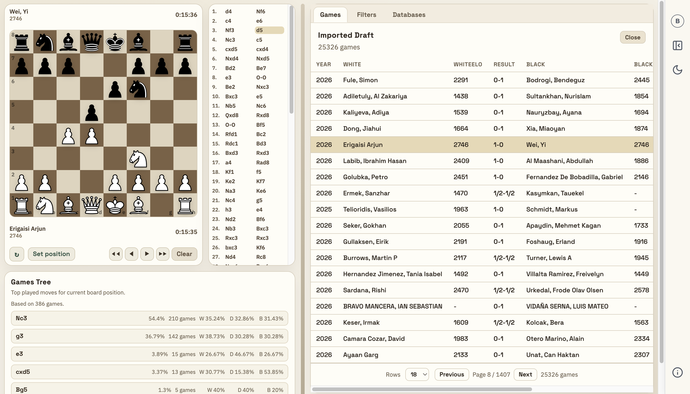
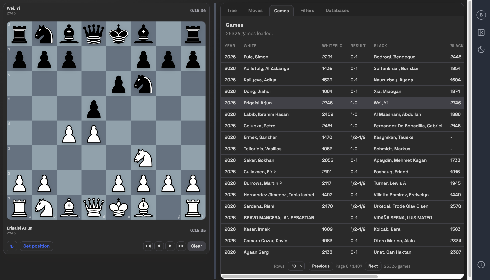
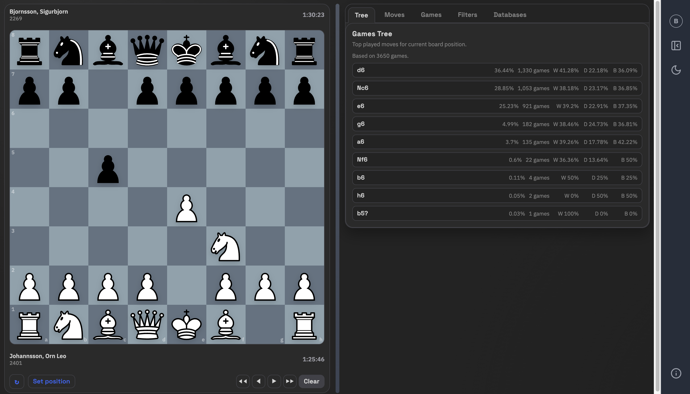
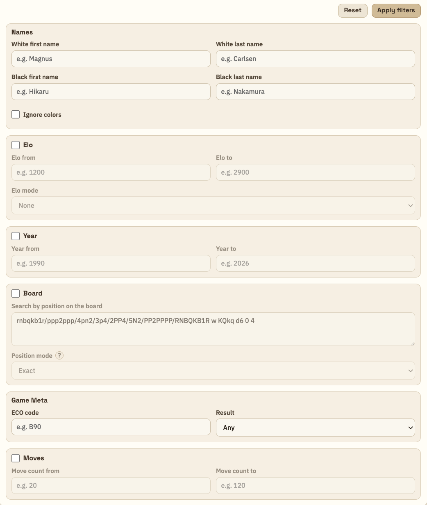
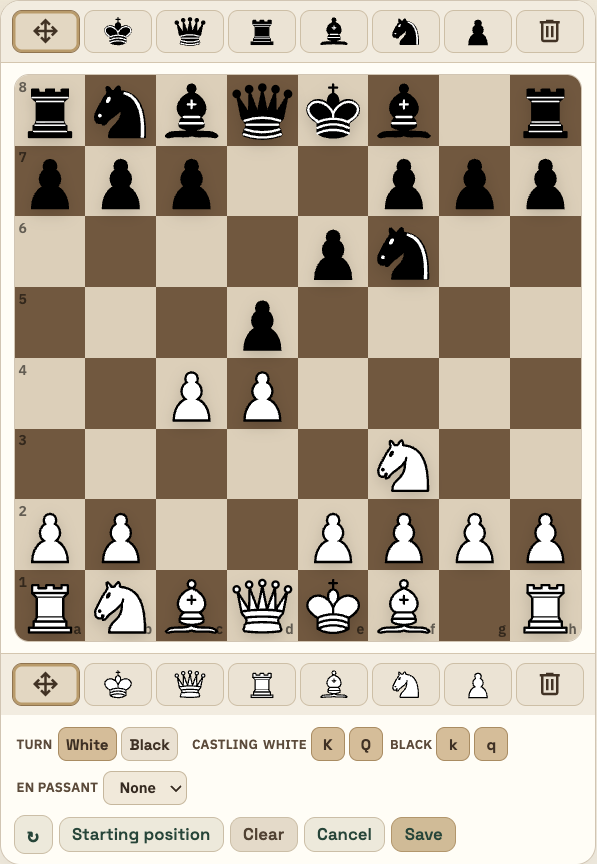
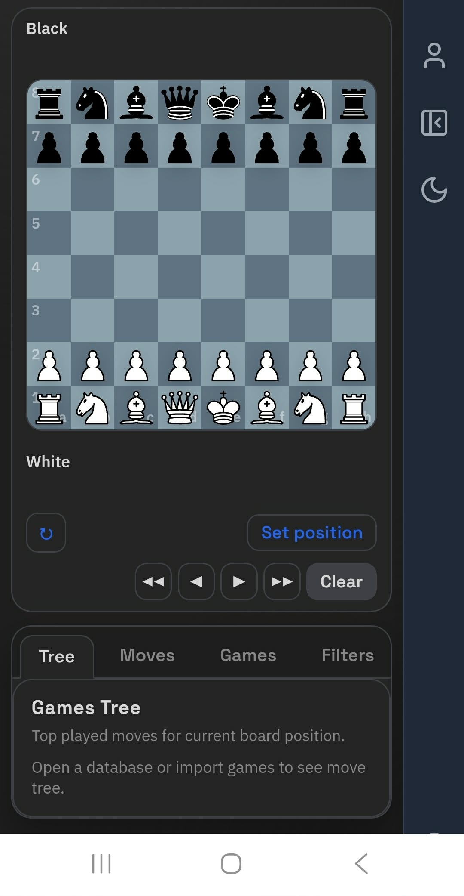
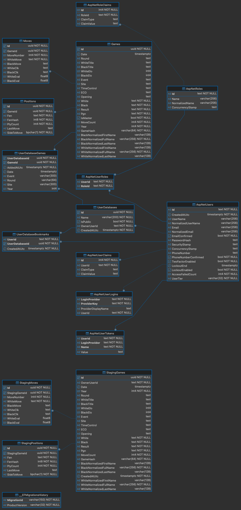

# ChessXiv
A High-Performance Chess Database & Explorer Web App

## Introduction
ChessXiv was created to bring a ChessBase-style experience to all platforms. It enables users to natively import their own PGN databases and efficiently search through them using a range of advanced filtering options. In addition, it introduces new functionality such as user accounts, allowing individuals to create community databases and share access with others. More features will be released soon!

Live Project: [chessxiv.org](https://chessxiv.org)  

## What ChessXiv offers in the current state?
Note that ChessXiv is currently in the early development stage. Described features will be actively updated alongside adding new functionalities. However, right now it can offer:
* Imports up to 100 MB - Users can import (.pgn) files up to 100 MB (approximately 20 000 games). While importing games can take some time, all filters and sorting options work almost instantly, which makes the experience very convenient.
* Multiple filter options - Users can filter imported games by names, ratings, year, board positions, ECO code, result, and move count. You can set specified options for each of these categories, and filtered results can be sorted by each displayed column.
* Board Setup - Users can move pieces around the board to create custom games and use them as a filter for imported games. You can also set up a single position (not starting from the initial position) with the board editor.
* Moves Tree - For each set of imported games, a moves tree is automatically created. It shows the user the most commonly played next moves based on the current board position and the imported games or filtered results.
* Convenient UI - The UI is very flexible; you can change the size of components dynamically by dragging the vertical line between them. There is also a focus mode that changes component alignment to make the board bigger, as well as a dark mode.

In the current state, to be able to import games, you need to create an account and verify your email (a confirmation email will be sent automatically). While this may seem unnecessary now, more features related to user accounts will be added in the future. This also serves as a way to avoid mass-bot imports that might crash the server.

---

## Architecture & Technicals

### High-Performance Chess Logic (Bitboards)
At the core of ChessXiv is a custom-built chess engine logic layer designed for maximum computational efficiency.
* Bitboard Representation (ulong64): Board states are represented using 64-bit integers (UInt64). This allows for lightning-fast legal move generation and board validation using bitwise operations (AND, OR, XOR, Shifting), which is significantly more efficient than traditional array-based board representations.
* Zobrist Hashing: Every unique board position is reduced to a 64-bit hash. This enables transposition-aware searches, meaning the system can identify the same board state even if it was reached through a different sequence of moves.

### Dual-Database Staging Architecture
To handle massive PGN uploads without impacting the performance of the primary production data, ChessXiv utilizes a decoupled storage strategy:
* The Staging Layer: When a user uploads a PGN, data is first ingested into a Temporary Staging Environment. This allows for high-speed validation and indexing of draft games without polluting the main global database.
* Automated Data Lifecycle: To ensure optimal storage efficiency, a background Hosted Service (StagingDraftCleanupService) monitors the staging tables. Any temporary data older than 24 hours is automatically purged, keeping the system lean and responsive.
* PostgreSQL Binary COPY: The infrastructure layer utilizes the Npgsql Binary COPY protocol. This maps C# objects directly to the PostgreSQL internal binary format, streaming data into the database at the maximum hardware limit—bypassing the overhead of standard SQL INSERT statements.

## User Identity & Lifecycle
ChessXiv implements account system using ASP.NET Core Identity.

* Two-Step Email Confirmation: To maintain system integrity and prevent bot spam, accounts require email verification. I integrated the Brevo API to handle transactional emails for registration and password resets.
* Secure Token Handling: Confirmation and password-reset tokens are Base64Url-encoded and cryptographically signed, ensuring they cannot be tampered with.
* Account Maintenance: An automated cleanup service handles the lifecycle of unconfirmed accounts, ensuring that abandoned registrations are removed after 24 hours.
* JWT Security: Authentication is handled via stateless JSON Web Tokens (JWT) with 256-bit signing keys, providing a secure, scalable bridge between the Angular frontend and the .NET API.

---

## Gallery

### User Interface & Explorer
The core of ChessXiv is a high-performance explorer designed for PGN analysis with native-feeling responsiveness and statistics integrated with the current board state.

  
   
  <i>Main Explorer: On-board position integrated move tree and thousands of games ready to open.</i>

  
  
   
  <i>Dark mode explorer in both default view and focus mode.</i>

---

### Advanced Tools & Mobile Support
Tailored filtering and setup tools ensure that users can find specific motifs or positions across millions of games, even on mobile devices.

  
  
  
   
  <i>From left: Advanced search parameters, custom position setup, responsive mobile layout.</i>

---

### Architecture & Data Logic
The backend is built for the heavy lifting required for bulk PGN ingestion and complex relational queries.

  
   
  <i>System Schema: PostgreSQL structure.</i>

